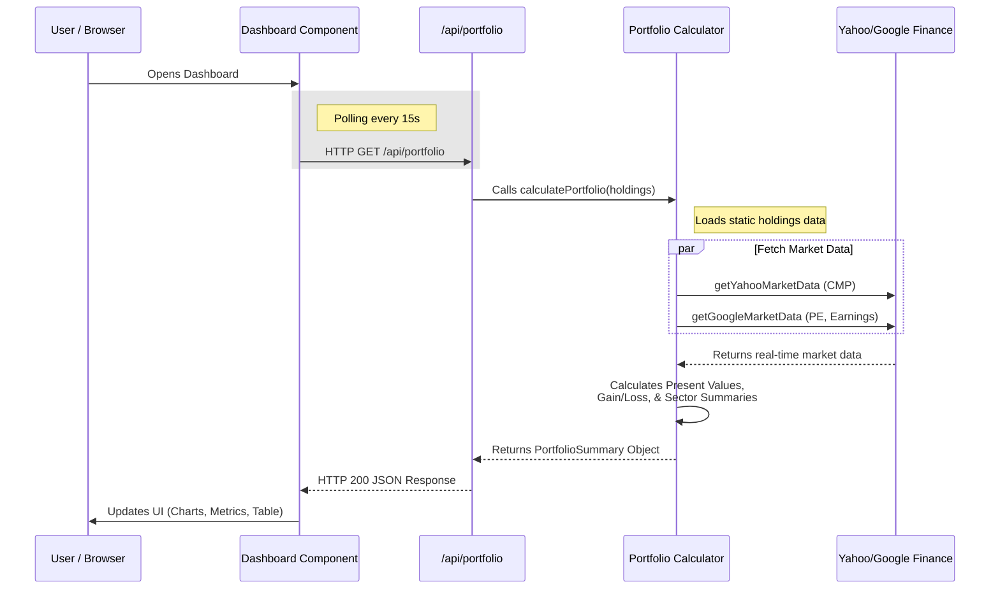

# 📊 Dynamic Portfolio Dashboard

A dynamic, real-time portfolio analytics dashboard for tracking stock holdings, monitoring market data, and analyzing portfolio performance across sectors.

## ✨ Features

- **Live Market Data:** Fetches Current Market Price (CMP) from **Yahoo Finance**, and P/E Ratios & Latest Earnings from **Google Finance**.
- **Dynamic Updates:** Automatically refreshes CMP, Present Value, and Gain/Loss every 15 seconds.
- **Portfolio Table:** Displays a comprehensive tabular view of holdings including Purchase Price, Quantity, Investment, Portfolio Weight (%), Present Value, and real-time Profit/Loss.
- **Visual Indicators:** Intuitive color-coding (Green for gains, Red for losses).
- **Sector Grouping:** Groups stocks by sectors (e.g., Financial, Tech, Consumer, Power) and provides sector-level summaries for Total Investment, Present Value, and Gain/Loss.
- **Responsive UI:** Modern, visually appealing, and fully responsive dashboard utilizing Tailwind CSS and Recharts.

## 🧑‍💻 Technology Stack

- **Frontend:** Next.js (React), Tailwind CSS, TypeScript
- **Backend:** Next.js App Router (Node.js)
- **Data Fetching:** `yahoo-finance2` (Node.js library for Yahoo Finance) for CMP data and Axios with Cheerio for web scraping the data from Google Finance.
- **Libraries:** shadcn/ui, Recharts, Lucide React, next-themes

## 🏗️ Architecture



## 🚀 Setup & Installation

1. **Clone the repository:**
   ```bash
   git clone <your-repo-url>
   cd portfolio-dashboard
   ```

2. **Install dependencies:**
   ```bash
   npm install
   ```

3. **Run the development server:**
   ```bash
   npm run dev
   ```

4. **Open your browser:**
   Navigate to [http://localhost:3000](http://localhost:3000) to view the dashboard.

## 📋 Technical Highlights

### 1. 🌐 Market Data & Rate Limiting

Yahoo Finance and Google Finance do not provide official free public APIs for this use case.

- **Yahoo Finance →** Current Market Price (CMP) using the `yahoo-finance2` library.
- **Google Finance →** P/E Ratio and Latest Earnings (EPS) using server-side web scraping with `Axios` and `Cheerio`.
- Market data is fetched server-side to avoid browser-side CORS restrictions.
- TTL-based in-memory caching and request deduplication reduce redundant external requests.

### 2. ⚡ Asynchronous Data Fetching

- `Promise.all` is used to fetch market data for multiple holdings concurrently.
- Fetched data is transformed into the `PortfolioSummary` structure used by the frontend.

### 3. 🚀 Performance & Dynamic Updates

- Market data is cached server-side to reduce external requests and improve response time.
- The dashboard automatically refreshes portfolio data every 15 seconds using `setInterval`.

### 4. 🛡️ Error Handling

- External API failures are handled gracefully without crashing the application.
- Missing market data is displayed appropriately, while background refresh failures preserve the last successful data.
- External data fetching remains server-side, keeping scraping logic away from the client.